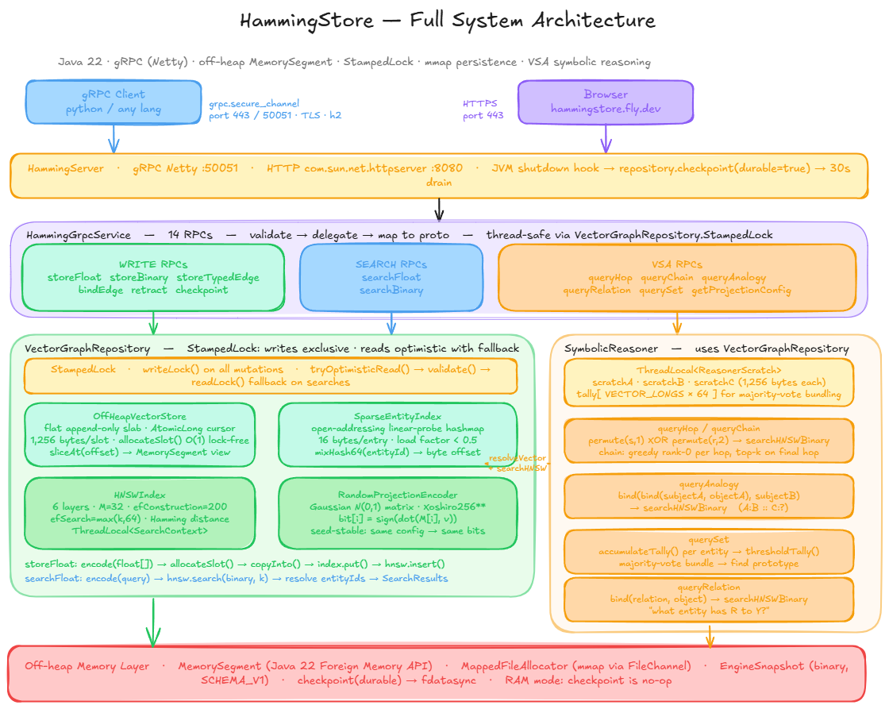
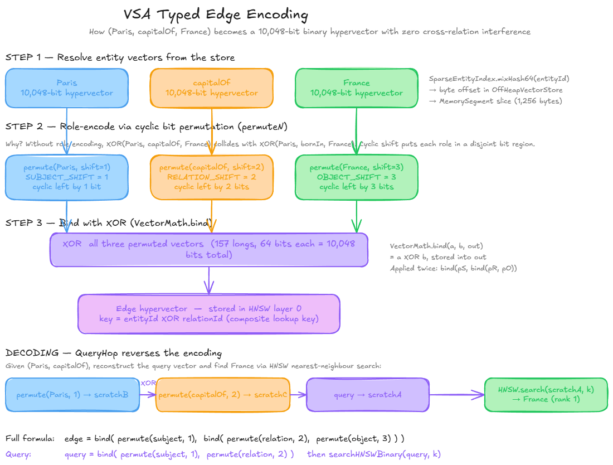
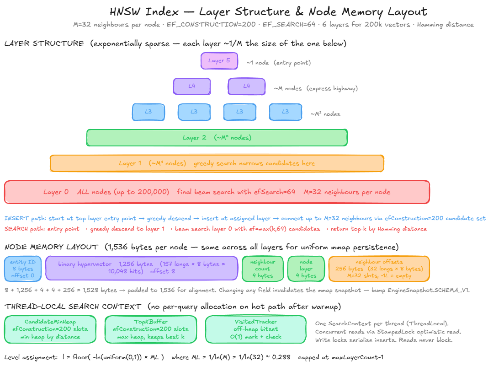
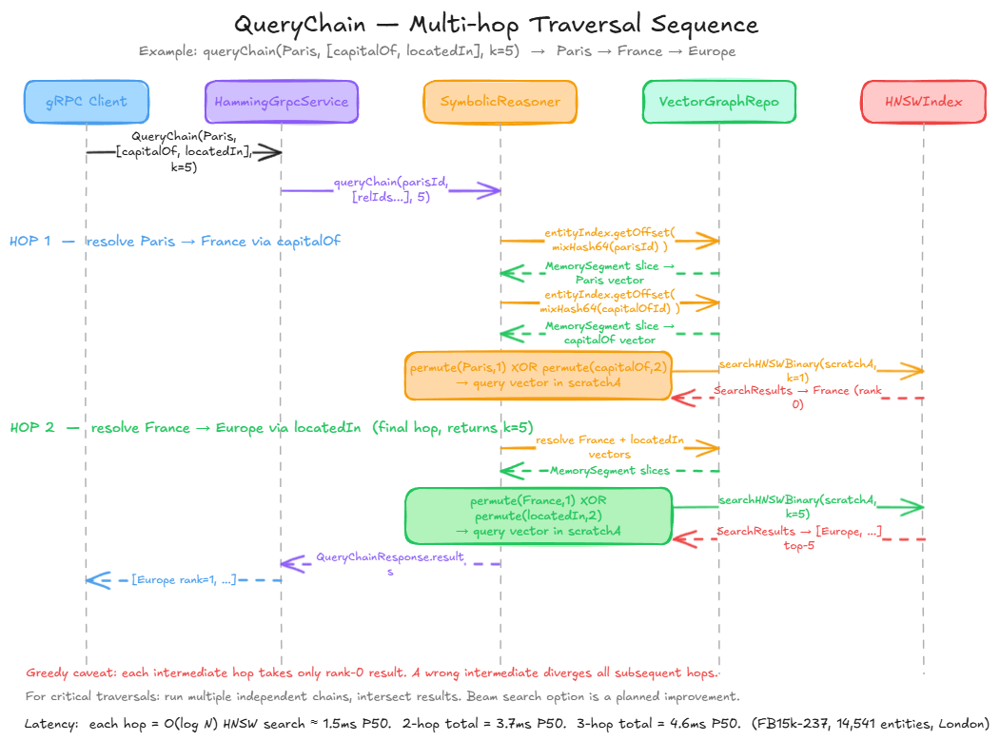
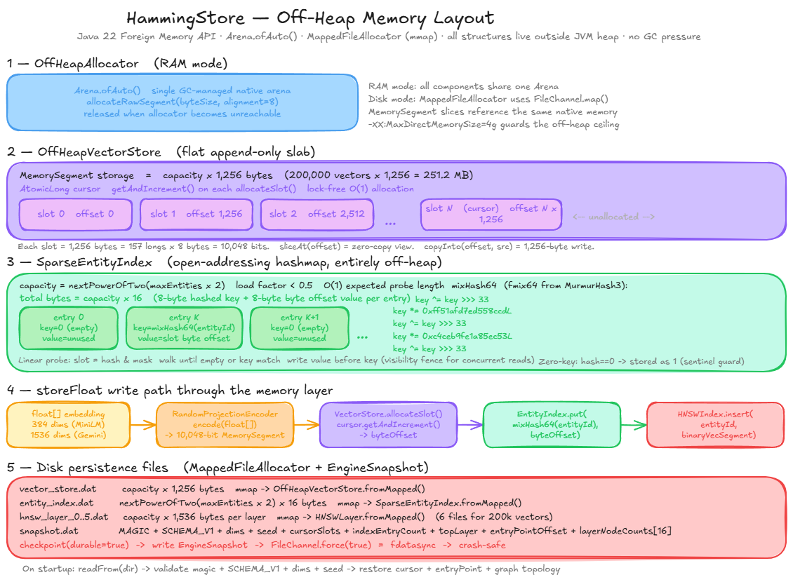
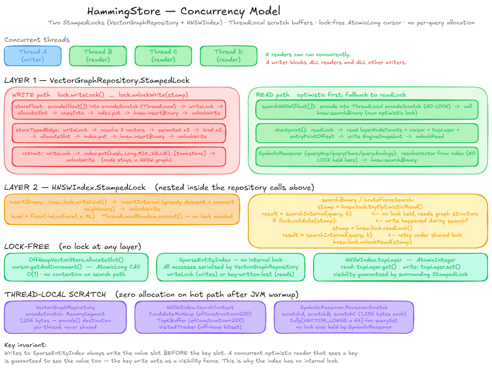

# HammingStore

**The zero-GC neuro-symbolic reasoning engine for binary hypervectors.**

Stores any float embedding as a 10,048-bit binary vector - 32x smaller than float32 - with native typed
relation binding, analogical inference and sub-5ms multi-hop chain traversal. No external LLM required. 
No python tax. Built on Java 22 off-heap memory with zero per-qiery allocation after warmup. 

**Landing page:** [hammingstore.fly.dev](https://hammingstore.fly.dev) · **gRPC endpoint:** `hammingstore.fly.dev:50051`

---

## Benchmark - FB15k-237
14,541 entities · 310,116 triples · MiniLM-L6-v2 · 384 dims · London (Fly.io) · March 2026

|           Metric          | HammingStore|     Baseline     |
|---------------------------|-------------|------------------|
| Memory                    | **18.3 MB** | 584.4 MB float32 |
| Compression               |   **32×**   |         _        |
| Search P50                |   11 ms     |         _        |
| 2-hop chain traversal P50 | **3.7 ms**  | not supported    |
| 3-hop chain traversal P50 | **4.6 ms**  | not supported    |

Pinecone, Weaviate and Qdrant do not support multi-hop traversal. Hammingstore does it in under 5ms. 

>HammingStore is an unsupervised symbolic reasoning engine. Classic supervised link-prediction metrics
are not the target use case - the strengths are compression, multi-hop traversal and an alogical inference.

---

## How it works

### Binary Hypervectors

Every float embedding is projected into a 10,048-bit binary vector using a seed-table Gaussian ramdom
projection matrix:

```
bit[i] = 1 if dot[M[i], embedding) > 0
         0 otherwise
```

The projection preserves angular similarity: 2 embeddings with high cosine similarity produce binary
vectors with low Hamming distance. Hardware popcount makes distance computation ~10x faster than float
dot products. The 32x memory reduction means a dataset that requires 548 MB in float32 fits at 18 MB. 

### VSA typed relations

Edges are stored using role-encoded XOR binding. Each participant gets a distinct cyclic bit per mutation
before binding, which eliminates cross-relation inferences:

```
edge = bind(permute(subject, 1), bind(permute(relation, 2), permute(object, 3)))
```

To query `(Paris, capitalOf, ?)`:

```
query  = bind(permute(Paris, 1), permute(capitalOf, 2))
result = HNSW.nearestNeighbour(query) -> France
```

Without role encoding, `XOR(Paris, capitalOf, France)` would collide with `XOR(Paris, bornIn, France)`
because relation vectors are only approximately orthogonal. Cyclic shifts put each role in a disjoint
region of the bit space. 

### Multi-hop chain traversal

```
queryChain(Paris, [capitalOf, locatedIn], k=5)
 
  hop 1: permute(Paris,1) XOR permute(capitalOf,2) -> HNSW search -> France (rank 0)
  hop 2: permute(France,1) XOR permute(locatedIn,2) -> HNSW search  -> [Europe, ...]
```

Each intermediate hop resolves greedily to rank 0. Final hop returns top-k. Latency is 
0 (hops x log N) - 3.7ms for 2 hops over 14,541 entities. 

### HNSW index

Approximate nearest neighbour graph on hamming distance. Key contants from source:

- M = 32 bidirectional links per node
- efConstruction = 200 candidate set during insert
- efSearch = max(k, 64) candidate set during query
- 6 layers for 200,000 vectors
- 1536 bytes per node: 8 (entity ID) + 1,256 (vector) + 4 (neighbour count) + 4 (layer) + 256
  (32 neighbour offsets)

### Off-heap memory

All data structures live outside the JVM heap via the Java 22 Foreign Memory API — no GC pressure:
 
- `OffHeapVectorStore` - flat append-only slab, 1,256 bytes/slot, lock-free `AtomicLong` cursor
- `SparseEntityIndex` - open-addressing linear-probe hashmap, 16 bytes/entry, load factor < 0.5, MurmurHash3 fmix64 key mixing
- `HNSWLayer` - per-layer node array, 1,536 bytes/node, memory-mapped in disk mode
 
In disk mode all three are memory-mapped via `FileChannel.map()`. On shutdown, `checkpoint(durable=true)` 
writes an `EngineSnapshot` and calls `fdatasync` for crash safety.

---

## Architecture diagrams

### System architecture


### VSA typed edge encoding

 
### HNSW layer structure

 
### QueryChain sequence

 
### Off-heap memory layout

 
### Concurrency model

